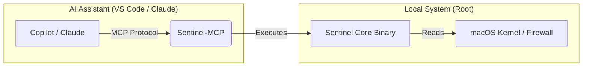

# Sentinel MCP Bridge

**Version 1.2.0** | [Roadmap](ROADMAP.md)

Sentinel MCP is a lightweight AI-to-System Bridge designed for macOS. It implements the Model Context Protocol (MCP) to connect Large Language Models (like Claude, GitHub Copilot, and Gemini) directly to your local hardware.

Instead of just chatting about code, Sentinel MCP empowers the AI to act as a local Site Reliability Engineer (SRE) by exposing two core capabilities:

- **Deep Telemetry:** Allows the AI to fetch real-time "Zeek-style" network flows, CPU thermal data (powermetrics), security audits, and system inventory.

- **Self-Healing:** Grants the AI permission to execute specific remediation commands, such as detecting a disabled firewall and automatically re-enabling it, killing runaway processes, or blocking malicious IPs.

It operates using a Dual-Architecture design: the MCP server handles the protocol translation, while securely delegating privileged tasks to the high-performance sentinel core binary.

### AI-Native Interface for macOS System Telemetry

**Sentinel MCP** is a Model Context Protocol (MCP) server that acts as a secure bridge between AI Assistants (GitHub Copilot, Claude Desktop, Roo Code) and your local macOS system.

It allows LLMs to "reach out" and interact with the **[Sentinel Core](https://github.com/jynxio/sentinel)** engine to monitor system health and perform self-healing security tasks.

---

## Architecture

This repository is the **Interface Layer**. It does not monitor the kernel directly; instead, it standardizes the communication between your AI editor and the Sentinel binary.



---

## ⚡ Available Tools (14 Total)

When installed, your AI assistant gains the following capabilities:

### Monitoring Tools
| Tool Name | Description |
| --- | --- |
| **`get_system_health`** | Real-time telemetry: CPU load, temperature, RAM, firewall status, and active network flows |
| **`get_top_processes`** | Top CPU/memory consuming processes with PID, name, and resource usage |
| **`get_asset_info`** | Complete hardware/software inventory: model, chip, RAM, OS version, storage, network interfaces |
| **`get_network_stats`** | Network interface statistics and connection counts by state |
| **`check_updates`** | Check for available macOS updates |
| **`list_blocked_ips`** | List all IP addresses currently blocked by Sentinel |

### Security Tools
| Tool Name | Description |
| --- | --- |
| **`security_audit`** | Comprehensive security posture assessment: SIP, Gatekeeper, FileVault, firewall status with score |
| **`scan_ports`** | Scan ports on a target host for security audits |

### Remediation Tools
| Tool Name | Description |
| --- | --- |
| **`enable_firewall`** | Enable the macOS Application Firewall if disabled |
| **`terminate_process`** | Kill a process by PID (SIGKILL) |
| **`block_ip_address`** | Block an IP address in the pf firewall (inbound + outbound) |
| **`unblock_ip_address`** | Remove an IP from the firewall blocklist |
| **`restart_service`** | Restart a launchd service (macOS) or systemd unit (Linux) |

### Fleet Tools
| Tool Name | Description |
| --- | --- |
| **`send_telemetry_webhook`** | Send current system telemetry to a remote HTTP endpoint |

---

## Prerequisites

1. **Sentinel Core v1.2.0+ Installed:**
This bridge requires the main `sentinel` binary to be installed and accessible in your path.
```bash
sentinel --version  # Should show v1.2.0 or higher
```

2. **Sudo Permissions (Critical):**
Because Sentinel accesses hardware sensors (thermals) and security settings (firewall), it runs as root. You must configure `sudo` to allow it to run without a password prompt.
Run `sudo visudo` and add this line to the bottom:
```bash
YOUR_USERNAME ALL=(ALL) NOPASSWD: /usr/local/bin/sentinel
```

---

## Installation

### 1. Build the Bridge

Clone this repository and compile the binary.

```bash
# Clone
git clone https://github.com/jynxio/sentinel-mcp.git
cd sentinel-mcp

# Build
go mod tidy
go build -ldflags "-s -w" -o sentinel-mcp

# Install
sudo mv sentinel-mcp /usr/local/bin/
```

### 2. Connect to AI Assistants

#### Option A: VS Code (GitHub Copilot)

Edit your Copilot MCP settings file:
`~/Library/Application Support/Code/User/globalStorage/github.copilot-chat/mcp-servers.json`

```json
{
  "mcpServers": {
    "sentinel": {
      "command": "/usr/local/bin/sentinel-mcp",
      "args": []
    }
  }
}
```

#### Option B: Claude Desktop

Edit your Claude configuration:
`~/Library/Application Support/Claude/claude_desktop_config.json`

```json
{
  "mcpServers": {
    "sentinel": {
      "command": "/usr/local/bin/sentinel-mcp",
      "args": []
    }
  }
}
```

---

## Usage Examples

Once configured, simply open your AI chat (Copilot or Claude) and ask:

### Health Check & Auto-Fix
> **User:** *"Check my system health. If the firewall is disabled, please fix it."*

**The AI will:**
1. Call `get_system_health` → Returns `{"firewall_status": "DISABLED", "temperature": "45.2"}`
2. Analyze the JSON
3. Call `enable_firewall` automatically
4. Respond: *"I detected your firewall was off, so I have enabled it for you."*

### Security Audit
> **User:** *"Is my Mac secure?"*

**The AI will:**
1. Call `security_audit` → Returns SIP, Gatekeeper, FileVault, firewall checks with a score
2. Identify any warnings or failures
3. Provide recommendations and offer to fix issues

### Process Management
> **User:** *"What's using all my CPU? Kill anything over 50%."*

**The AI will:**
1. Call `get_top_processes` → Returns list sorted by CPU usage
2. Identify high-CPU processes
3. Call `terminate_process` for offenders (with your approval)

### Network Security
> **User:** *"Block the IP 192.168.1.100 - it looks suspicious."*

**The AI will:**
1. Call `block_ip_address` with the IP
2. Confirm the block was applied

---

## Tool Reference

### Parameters

| Tool | Required Parameters | Optional Parameters |
|------|---------------------|---------------------|
| `get_system_health` | - | - |
| `terminate_process` | `pid` (int) | `reason` (string) |
| `block_ip_address` | `ip` (string) | `reason` (string) |
| `unblock_ip_address` | `ip` (string) | - |
| `list_blocked_ips` | - | - |
| `enable_firewall` | - | - |
| `send_telemetry_webhook` | `url` (string) | - |
| `get_top_processes` | - | `count` (int, default: 10) |
| `restart_service` | `service` (string) | - |
| `check_updates` | - | - |
| `scan_ports` | `target` (string) | `port_range` (string) |
| `get_asset_info` | - | - |
| `get_network_stats` | - | - |
| `security_audit` | - | - |

---

## Troubleshooting

* **Error: `sudo: a password is required`**
  * **Fix:** You missed the `visudo` step in Prerequisites. The bridge cannot type your password for you; it needs password-less access to the `sentinel` binary.

* **Error: `flag provided but not defined: -top`**
  * **Fix:** Your core `sentinel` binary is outdated. Update to v1.2.0 or later.

* **Error: `sentinel: command not found`**
  * **Fix:** Install the Sentinel Core binary and ensure it's in your PATH (`/usr/local/bin/sentinel`).

---

## License

MIT License. Part of the Sentinel Ecosystem.