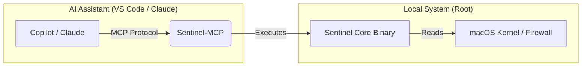

# Sentinel MCP Bridge


Sentinel MCP is a lightweight AI-to-System Bridge designed for macOS. It implements the Model Context Protocol (MCP) to connect Large Language Models (like Claude, GitHub Copilot, and Gemini) directly to your local hardware.

Instead of just chatting about code, Sentinel MCP empowers the AI to act as a local Site Reliability Engineer (SRE) by exposing two core capabilities:

Deep Telemetry: Allows the AI to fetch real-time "Zeek-style" network flows, CPU thermal data (powermetrics), and security logs.

Self-Healing: Grants the AI permission to execute specific remediation commands, such as detecting a disabled firewall and automatically re-enabling it.

It operates using a Dual-Architecture design: the MCP server handles the protocol translation, while securely delegating privileged tasks to the high-performance sentinel core binary.

### AI-Native Interface for macOS System Telemetry

**Sentinel MCP** is a Model Context Protocol (MCP) server that acts as a secure bridge between AI Assistants (GitHub Copilot, Claude Desktop, Roo Code) and your local macOS system.

It allows LLMs to "reach out" and interact with the **[Sentinel Core](https://www.google.com/search?q=https://github.com/YOUR_USERNAME/sentinel)** engine to monitor system health and perform self-healing security tasks.

---

## Architecture

This repository is the **Interface Layer**. It does not monitor the kernel directly; instead, it standardizes the communication between your AI editor and the Sentinel binary.



---

## ⚡ Available Tools

When installed, your AI assistant gains the following capabilities:

| Tool Name | Description |
| --- | --- |
| **`get_system_health`** | Retrieves real-time telemetry: CPU Load, Thermal status (die temp), RAM usage, and Firewall status. |
| **`enable_firewall`** | **Self-Healing:** Instantly enables the macOS Application Firewall if telemetry detects it is disabled. |

---

## Prerequisites

1. **Sentinel Core Installed:**
This bridge requires the main `sentinel` binary to be installed and accessible in your path.
* *See main repo:* `github.com/YOUR_USERNAME/sentinel`


2. **Sudo Permissions (Critical):**
Because Sentinel accesses hardware sensors (thermals) and security settings (firewall), it runs as root. You must configure `sudo` to allow it to run without a password prompt.
Run `sudo visudo` and add this line to the bottom:
```bash
YOUR_USERNAME ALL=(ALL) NOPASSWD: /usr/local/bin/sentinel

```


---

## Installation

### 1. Build the Bridge

Clone this repository and compile the binary.

```bash
# Clone
git clone https://github.com/YOUR_USERNAME/sentinel-mcp.git
cd sentinel-mcp

# Build
go mod tidy
go build -ldflags "-s -w" -o sentinel-mcp

# Install
sudo mv sentinel-mcp /usr/local/bin/

```

### 2. Connect to AI Assistants

#### Option A: VS Code (GitHub Copilot)

Edit your Copilot MCP settings file:
`~/Library/Application Support/Code/User/globalStorage/github.copilot-chat/mcp-servers.json`

```json
{
  "mcpServers": {
    "sentinel": {
      "command": "/usr/local/bin/sentinel-mcp",
      "args": []
    }
  }
}

```

#### Option B: Claude Desktop

Edit your Claude configuration:
`~/Library/Application Support/Claude/claude_desktop_config.json`

```json
{
  "mcpServers": {
    "sentinel": {
      "command": "/usr/local/bin/sentinel-mcp",
      "args": []
    }
  }
}

```

---

## Usage Example

Once configured, simply open your AI chat (Copilot or Claude) and ask:

> **User:** *"Check my system health. If the firewall is disabled, please fix it."*

**The AI will:**

1. Call `get_system_health` → Returns `{"Firewall": "DISABLED", "Temp": "45C"}`.
2. Analyze the JSON.
3. Call `enable_firewall` automatically.
4. Respond: *"I detected your firewall was off, so I have enabled it for you."*

---

## Troubleshooting

* **Error: `sudo: a password is required**`
* **Fix:** You missed the `visudo` step in Prerequisites. The bridge cannot type your password for you; it needs password-less access to the `sentinel` binary.


* **Error: `flag provided but not defined: -json**`
* **Fix:** Your core `sentinel` binary is outdated. Update the main Sentinel repo to the latest version that supports the `--json` flag.


---

## License

MIT License. Part of the Sentinel Ecosystem.